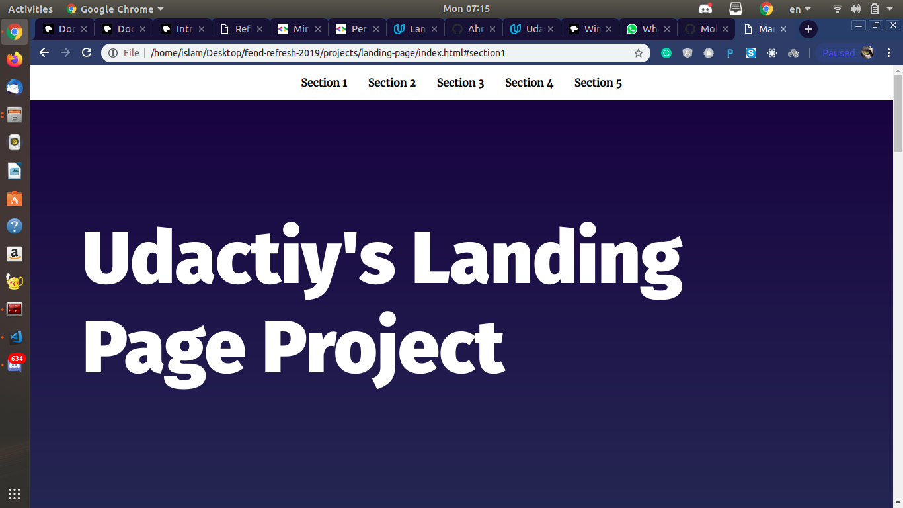

# Landing Page Project

## Table of Contents

* Html and css mostly from udacity's startup project with some changes
* use DOM to create a navbar 
* smooth scroll with css
* add a scroll to top button
* add and remove active class when scrolling through the sections 

## Instructions

The starter project has some HTML and CSS styling to display a static version of the Landing Page project. You'll need to convert this project from a static project to an interactive one. This will require modifying the HTML and CSS files, but primarily the JavaScript file.

To get started, open `js/app.js` and start building out the app's functionality

For specific, detailed instructions, look at the project instructions in the Udacity Classroom.

## sources used 

* https://www.w3schools.com/howto/howto_js_scroll_to_top.asp
* https://developer.mozilla.org/en-US/docs/Glossary/Viewport
* https://developer.mozilla.org/en-US/docs/Web/API/Element/getBoundingClientRect
* http://udacity.github.io/frontend-nanodegree-styleguide/index.html
* http://udacity.github.io/frontend-nanodegree-styleguide/css.html
* http://udacity.github.io/frontend-nanodegree-styleguide/javascript.html

